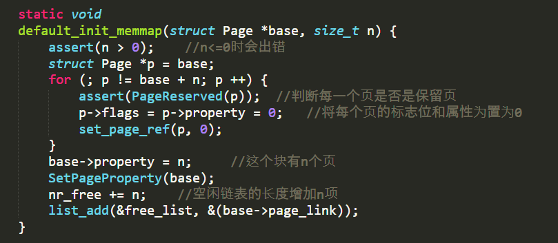
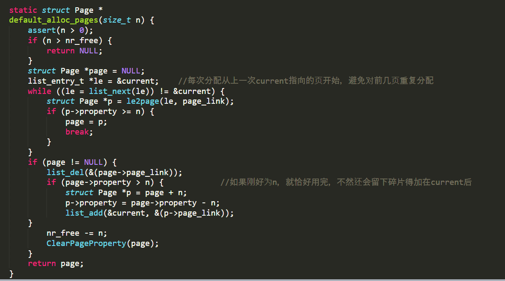
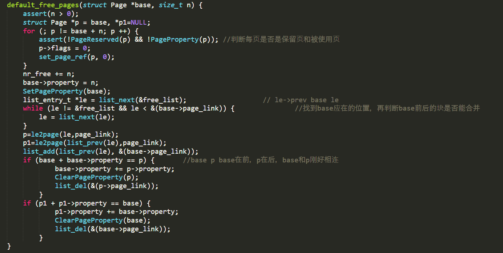
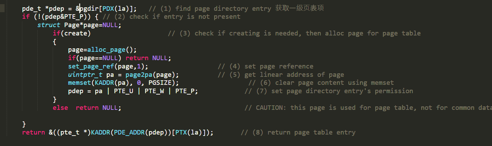
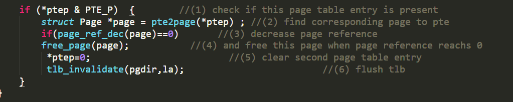

##                                     Lab2

### 1.实现 first-fit 连续物理内存分配算法

首先是初始化空闲内存，判断每个页面是否是保留页，将标志位和属性置为0

由于是first-fit算法，只需从链表头开始找到一个比所需内存大的空闲内存，注意出现了碎片，要将碎片加在链表里

释放内存，主要考虑是否可以和之前的和之后的页表合并成更大的内存页。

对于是否有改进的地方，在时间复杂度上好像first-fit并无可优化的地方，我就改变每次查找的起点，就是上次分配的下一页。（如果下次适配法也是首先适配法的话，但是新增一个current指针会导致check过不了，最后define current head才过了check。）

## 2.：实现寻找虚拟地址对应的页表项

由于ucore没有实现段机制，相比段页式要简单。

将传入的虚拟地址转换为对应的页表，就是一个二维数组的查找，主要令人头疼的就是地址的转换，什么page2pa(),KADDR(),PDE_ADDR()之类的看一遍根本记不住。

###PDE的具体组成部分

前20位表示4K对齐的该PDE对应的页表起始位置（物理地址，该物理地址的高20位即PDE中的高20位，低12位为0）；

第9-11位未被CPU使用，可保留给OS使用；

接下来的第8位可忽略；

第7位用于设置Page大小，0表示4KB；

第6位恒为0；

第5位用于表示该页是否被使用过；

第4位设置为1则表示不对该页进行缓存；

第3位设置是否使用write through缓存写策略；

第2位表示该页的访问需要的特权级；

第1位表示是否允许读写；

第0位为该PDE的存在位

###PTE的具体组成部分

高20位与PDE相似的，用于表示该PTE指向的物理页的物理地址；

9-11位保留给OS使用；

7-8位恒为0；

第6位表示该页是否为dirty，即是否需要在swap out的时候写回外存；

第5位表示是否被访问；

3-4位恒为0；

0-2位分别表示存在位、是否允许读写、访问该页需要的特权级；

最常使用的都是前20位，用于查找页表项，其中还有一些也有用，比如设置是否能读写，访问的权限等。

###如果ucore执行过程中访问内存，出现了页访问异常，请问硬件要做哪些事情？

当ucore执行过程中出现了页访问异常，硬件需要完成的事情分别如下：
   - 将发生错误的线性地址保存在cr2寄存器中;

   - 在中断栈中依次压入EFLAGS，CS, EIP，以及页访问异常码error code，如果page fault是发生在用户态，则还需要先压入ss和esp，并且切换到内核栈；

   - 根据中断描述符表查询到对应page fault的ISR，跳转到对应的ISR处执行，接下来将由软件进行page fault处理

     

     ###释放某虚地址所在的页并取消对应二级页表项的映射

主要注意是否还有对该页的引用，如果没有就可以将PTE表项也释放掉。还有就是要刷新TLB，否则CPU从TLB取出的数据就是错误的。

###数据结构Page的全局变量（其实是一个数组）的每一项与页表中的页目录项和页表项有无对应关系？如果有，其对应关系是啥？
存在对应关系：由于页表项中存放着对应的物理页的物理地址，因此可以通过这个物理地址来获取到对应到的Page数组的对应项，具体做法为将物理地址除以一个页的大小，然后乘上一个Page结构的大小获得偏移量，使用偏移量加上Page数组的基地址皆可以或得到对应Page项的地址；

###如果希望虚拟地址与物理地址相等，则需要如何修改lab2，完成此事？

由于在完全启动了ucore之后，虚拟地址和线性地址相等，都等于物理地址加上0xc0000000，如果需要虚拟地址和物理地址相等，可以考虑更新gdt，更新段映射，使得virtual address = linear address - 0xc0000000，这样的话就可以实现virtual address = physical address；
