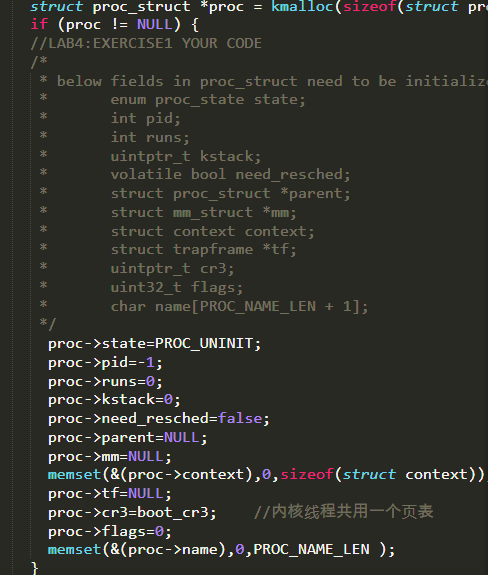
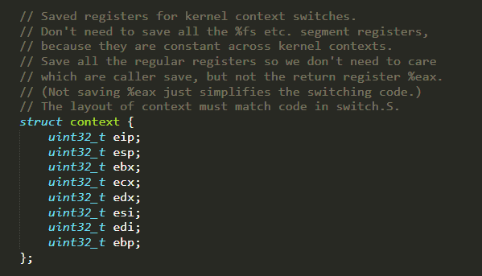
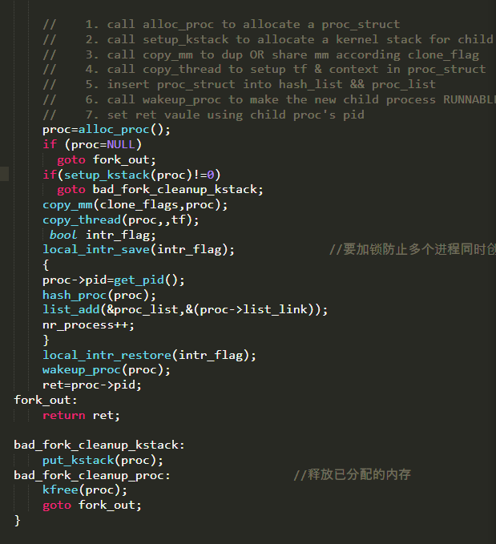
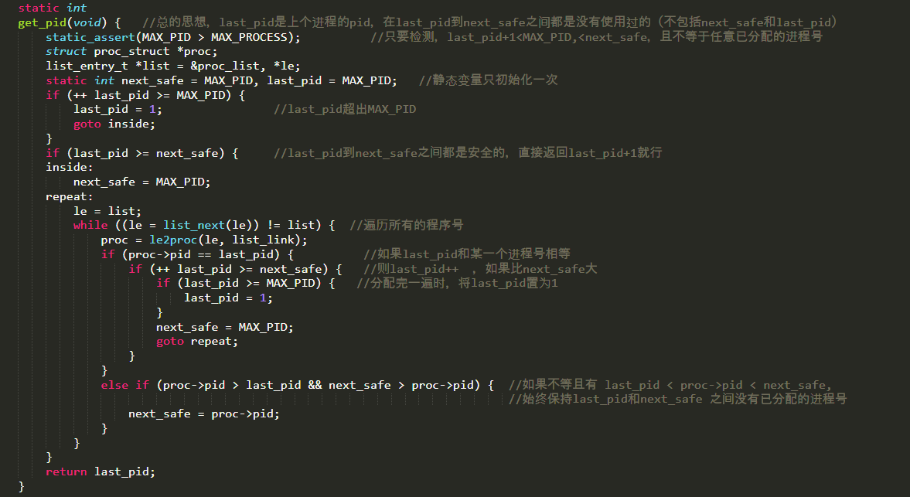
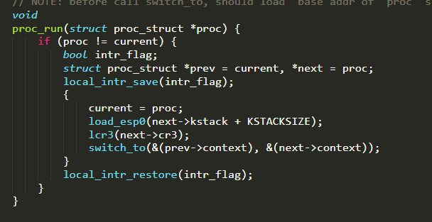
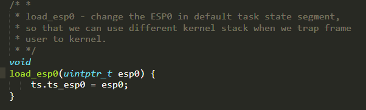
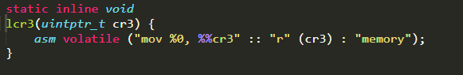
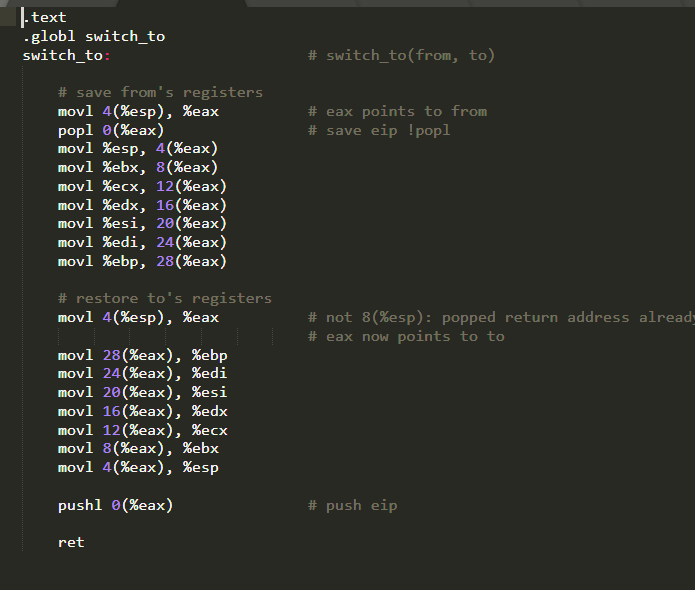

##                                                   Lab4

### 练习1：分配并初始化一个进程控制块

可以看到已经通过kmalloc获取了一块proc_struct大小的内存，只需进行初始化就行了。需要注意的是state 赋值为PROC_UNINIT表示还未初始化，pid=-1表示还未初始化，cr3赋值为boot_cr3，表示内核线程共用一个页表。

context 保留线程运行的上下文环境

tf构造一个伪造的中断返回现场，通过中断返回，将控制权交给新的线程。

### 练习2：为新创建的内核线程分配资源

根据提示，一步步调用函数，并判断是否分配资源成功，如果不成功，需要释放掉已经分配了的资源。还有需要注意的是，在对线程分配pid和加入哈希表和链表时要关中断，不然此时如果发生中断，会导致意想不到的错误。

ucore是给每个新fork的进程一个唯一的id，在get_pid()函数里实现

get_pid（）写得十分复杂，但主要工作是维护两个static变量 last_pid和next_safe，保证在（last_pid , next_safe）的区间里，都是未分配的id，新的pid就是last_pid+1，直到last_pid比next_safe大或者MAX_PID大

这么做的好处就是能提高分配id的效率，在大多数情况下时间复杂度都是O（1）

###练习3：阅读代码，理解 proc_run函数和它调用的函数如何完成进程切换的。

首先是判断当前线程是否在运行，再进行关中断

加载新线程的tss和cr3寄存器。

保留原线程寄存器的状态，再加载新线程的寄存器。

两个内核线程，idleproc和initproc

idleproc内核线程的工作就是不停地查询，看是否有其他内核线程可以执行了，如果有，马上让调度器选择那个内核线程执行。

initproc内核线程的工作就是显示“Hello World”，表明自己存在且能正常工作了。

关闭中断

如果current赋值为proc后被打断，那么此时的运行环境还是之前的线程遗留下的，运行就会出错。