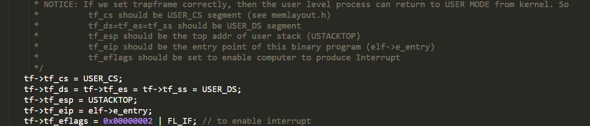
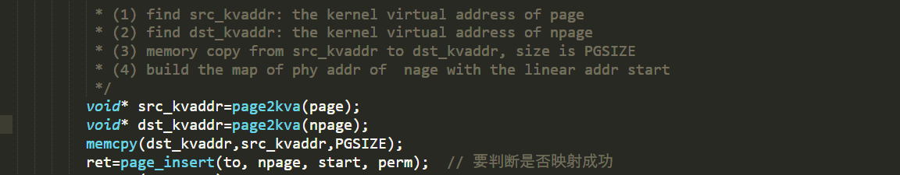

##                                         Lab5

### 练习0：补充和更新代码

1.在初始化IDT的时候，设置系统调用对应的中断描述符

```
    extern uintptr_t __vectors[];
    int i;
    for (i = 0; i < sizeof(idt) / sizeof(struct gatedesc); i ++) {
        SETGATE(idt[i], 0, GD_KTEXT, __vectors[i], DPL_KERNEL);
    }
    SETGATE(idt[T_SYSCALL], 1, GD_KTEXT, __vectors[T_SYSCALL], DPL_USER);  //new
    lidt(&idt_pd);
```

2.在时钟中断的处理部分，每过TICK_NUM个中断，就将当前的进程设置为可以被重新调度的

```
      ticks ++;
        if (ticks % TICK_NUM == 0) {
            assert(current != NULL);
            current->need_resched = 1;  //new
        }
```

3.proc_alloc初始化新增变量

```
        proc->state = PROC_UNINIT;
        proc->pid = -1;
        proc->runs = 0;
        proc->kstack = 0;
        proc->need_resched = 0;
        proc->parent = NULL;
        proc->mm = NULL;
        memset(&(proc->context), 0, sizeof(struct context));
        proc->tf = NULL;
        proc->cr3 = boot_cr3;
        proc->flags = 0;
        memset(proc->name, 0, PROC_NAME_LEN);
        proc->wait_state = 0;      //new
        proc->cptr = proc->optr = proc->yptr = NULL;//new
```

4.do_fork函数 将当前进程的设为父进程

```
	/* Some Functions
    *    set_links:  set the relation links of process.  ALSO SEE: remove_links:  lean the relation links of process 
    *    -------------------
	*    update step 1: set child proc's parent to current process, make sure current process's wait_state is 0
	*    update step 5: insert proc_struct into hash_list && proc_list, set the relation links of process
    */
	proc->parent = current;
    assert(current->wait_state == 0);
    if (setup_kstack(proc) != 0) {
        goto bad_fork_cleanup_proc;
    }
    if (copy_mm(clone_flags, proc) != 0) {
        goto bad_fork_cleanup_kstack;
    }
    copy_thread(proc, stack, tf);

    bool intr_flag;
    local_intr_save(intr_flag);
    {
        proc->pid = get_pid();
        hash_proc(proc);
        set_links(proc);
     // nr_process ++;set_links已经加1
    }
    local_intr_restore(intr_flag);
    wakeup_proc(proc);
    ret = proc->pid;
```


###练习1：加载应用程序并执行



exec()->系统中断->syscall(sys_exec)->do_execve()

推出当前进程的页表，换用kernel的PDT之后，使用load_icode函数，完成了对整个用户线程内存空间的初始化，包括堆栈的设置以及将ELF可执行文件的加载，之后通过current->tf指针修改了当前系统调用的trapframe，使得最终中断返回的时候能够切换到用户态，并且同时可以正确地将控制权转移到应用程序的入口处

进行正常的中断返回的流程，由于中断处理例程的栈上面的eip已经被修改成了应用程序的入口处，而cs上的CPL是用户态，因此iret进行中断返回的时候会将堆栈切换到用户的栈，并且完成特权级的切换，并且跳转到要求的应用程序的入口处


### 练习2：父进程复制自己的内存空间给子进程




找到父进程指定的某一物理页对应的内核虚拟地址；

找到需要拷贝过去的子进程的对应物理页对应的内核虚拟地址；

将前者的内容拷贝到后者中去；

为子进程当前分配这一物理页映射上对应的在子进程虚拟地址空间里的一个虚拟页；

Copy On Write

在copy_range函数内部，不实际进行内存的复制，而是将子进程和父进程的虚拟页映射上同一个物理页面，然后在分别在这两个进程的虚拟页对应的PTE部分将这个页置成是不可写的，同时利用PTE中的保留位将这个页设置成共享的页面，这样的话如果应用程序试图写某一个共享页就会产生页访问异常，从而可以将控制权交给操作系统进行处理；

在缺页处理里新增一个条件分支，如果当前的异常是由于尝试写了某一个共享页面引起的，额外申请分配一个物理页面，然后将当前的共享页的内容复制过去，建立出错的线性地址与新创建的物理页面的映射关系，将PTE设置设置成非共享的；然后查询原先共享的物理页面是否还是由多个其他进程共享使用的，如果不是的话，就将对应的虚地址的PTE进行修改，删掉共享标记，恢复写标记；这样的话page fault返回之后就可以正常完成对虚拟内存（原想的共享内存）的写操作了；


###练习3：阅读分析源代码，理解进程执行 fork/exec/wait/exit 的实现，以及系统调用的实现

fork：在执行了fork系统调用之后，会执行正常的中断处理流程，最终将控制权转移给syscall，之后根据系统调用号执行sys_fork函数，进一步执行了上文中的do_fork函数，完成新的进程的进程控制块的初始化、设置、以及将父进程内存中的内容到子进程的内存的复制工作，然后将新创建的进程放入可执行队列（runnable），这样的话在之后就有可能由调度器将子进程运行起来了；

exec：在执行了exec系统调用之后，会执行正常的中断处理流程，最终将控制权转移给syscall，之后根据系统调用号执行sys_exec函数，进一步执行了上文中的do_execve函数，在该函数中，会对内存空间进行清空，然后将新的要执行的程序加载到内存中，然后设置好中断帧，使得最终中断返回之后可以跳转到指定的应用程序的入口处，就可以正确执行了；

wait：在执行了wait系统调用之后，会执行正常的中断处理流程，最终将控制权转移给syscall，之后根据系统调用号执行sys_wait函数，进一步执行了的do_wait函数，在这个函数中，将搜索是否指定进程存在着处于ZOMBIE态的子进程，如果有的话直接将其占用的资源释放掉即可；如果找不到这种子进程，则将当前进程的状态改成SLEEPING态，并且标记为等待ZOMBIE态的子进程，然后调用schedule函数将其当前线程从CPU占用中切换出去，直到有对应的子进程结束来唤醒这个进程为止；

exit：在执行了exit系统调用之后，会执行正常的中断处理流程，最终将控制权转移给syscall，之后根据系统调用号执行sys_exit函数，进一步执行了的do_exit函数，首先将释放当前进程的大多数资源，然后将其标记为ZOMBIE态，然后调用wakeup_proc函数将其父进程唤醒（如果父进程执行了wait进入SLEEPING态的话），然后调用schedule函数，让出CPU资源，等待父进程进一步完成其所有资源的回收；

fork不会影响当前进程的执行状态，但是会将子进程的状态标记为RUNNALB，使得可以在后续的调度中运行起来；

exec不会影响当前进程的执行状态，但是会修改当前进程中执行的程序；

wait系统调用取决于是否存在可以释放资源（ZOMBIE）的子进程，如果有的话不会发生状态的改变，如果没有的话会将当前进程置为SLEEPING态，等待执行了exit的子进程将其唤醒；

exit会将当前进程的状态修改为ZOMBIE态，并且会将父进程唤醒（修改为RUNNABLE），然后主动让出CPU使用权；


