### 关于Makefile

### 练习一

####1.1

首先将kern下的.s和.c文件生成.o和.d文件，再进行链接生成kernel文件，然后将boot下的.s和.c文件生成.o和.d文件，再进行链接生成bootblock文件，然后通过编译sign.c文件最终生成ucore.img（具体过程可参照Makefile和function.mk两个文件中的注释和terminal文件）

####1.2

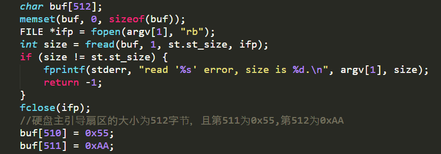

从sign.c可以看出主引导扇区的大小必须是512字节，且倒数第一个扇区为0xAA，倒数第二个为0x55

### 练习二

####2.1单步跟踪bios执行

####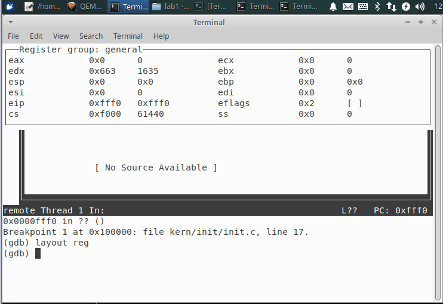

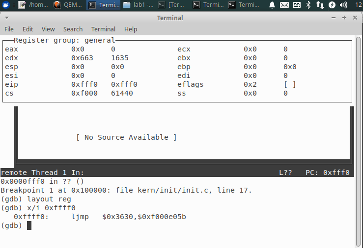

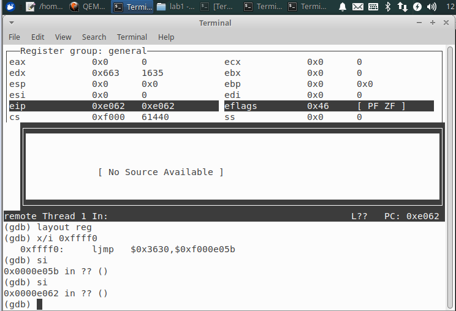

####2.2在初始化位置0x7c00设置实地址断点,测试断点正常。

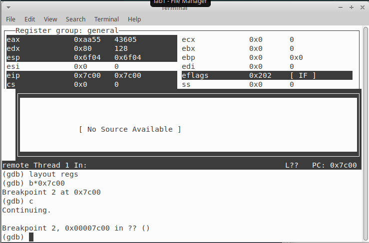

####2.3 从0x7c00开始跟踪代码运行,将单步跟踪反汇编得到的代码与bootasm.S和 bootblock.asm进行比较。

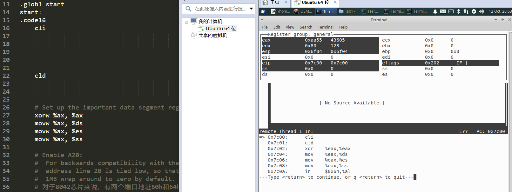

根据答案改写Makefile文件使运行的汇编代码保存在q.log中，比单步调试看要快

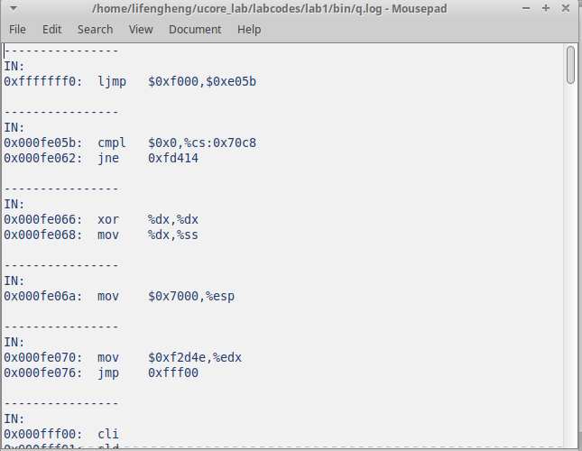

####2.4将断点设在cons_init

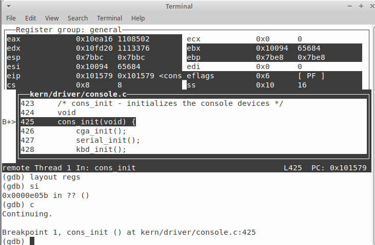

### 练习3

#### 3.1

为何开启A20？

是因为要向下兼容，计算机由16位到32位，寻址空间达到4GB，之前段地址加偏移地址的寻址范围刚好超过1MB的内存空间，虽然超过了一点点，但由于由“回卷”功能，并不会出现异常。在下一代80286计算机提供24根地址线，此时寻址范围超过看1MB，由于系统不会再回卷，造成了向下不兼容。所以IBM决定在PC AT计算机系统上加个硬件逻辑，来模仿以上的回绕特征，这就是A20Gate。

将A20地址线控制和键盘控制器的一个输出进行AND操作，这样来控制A20地址线的打开与关闭。

如何开启将第20位置为1

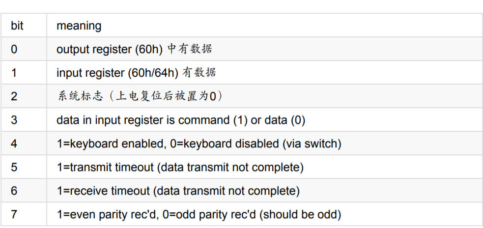

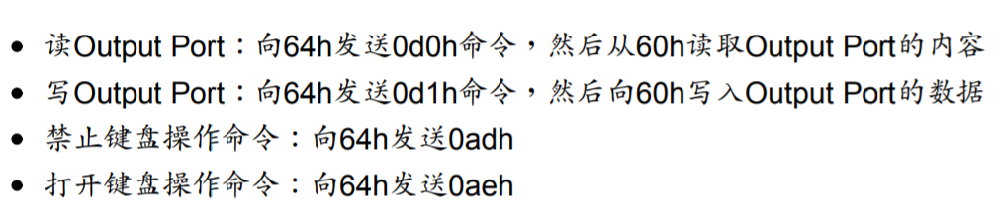

加载GDT

将cr0最低位置为1

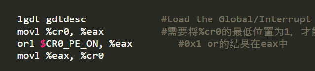

### 练习4

####4.1

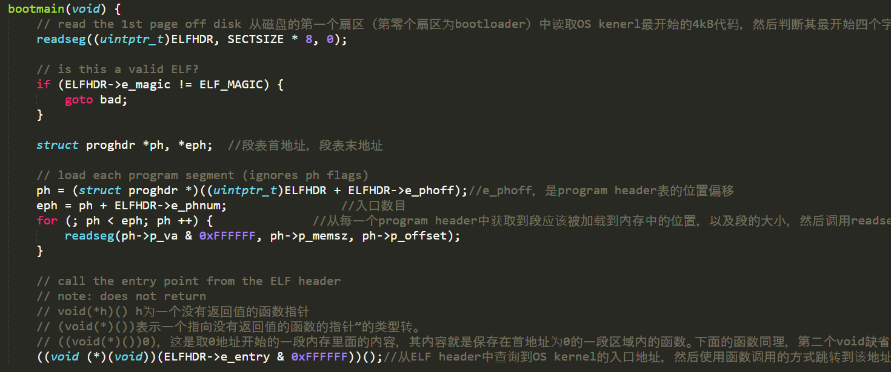

首先从磁盘第一个扇区读4KB(512*8)判断最开始的4个字节是否有效

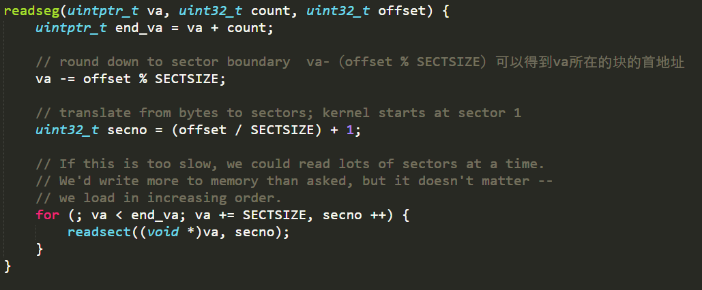

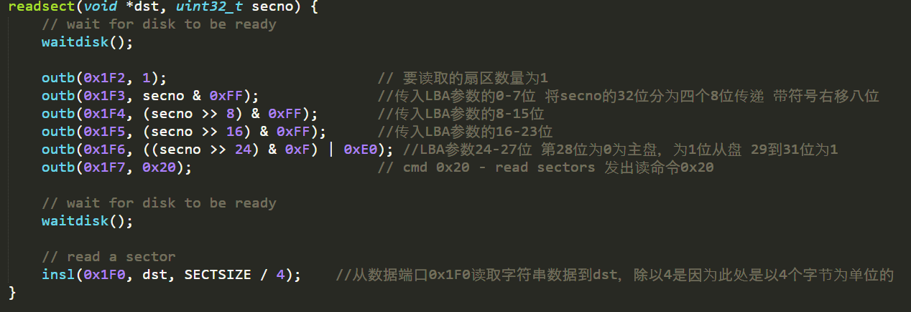

磁盘IO地址及对应的功能，readsect就是在进行传参。

再从每一个program header中获取段应该被加载到内存中的的大小然后调用readseg将每一个段加载到内存中

最后以函数调用的方式找到kernel的入口地址

####

### 练习5

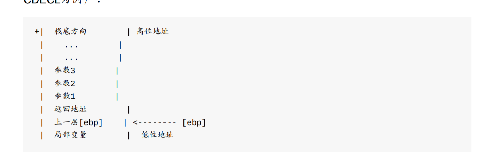

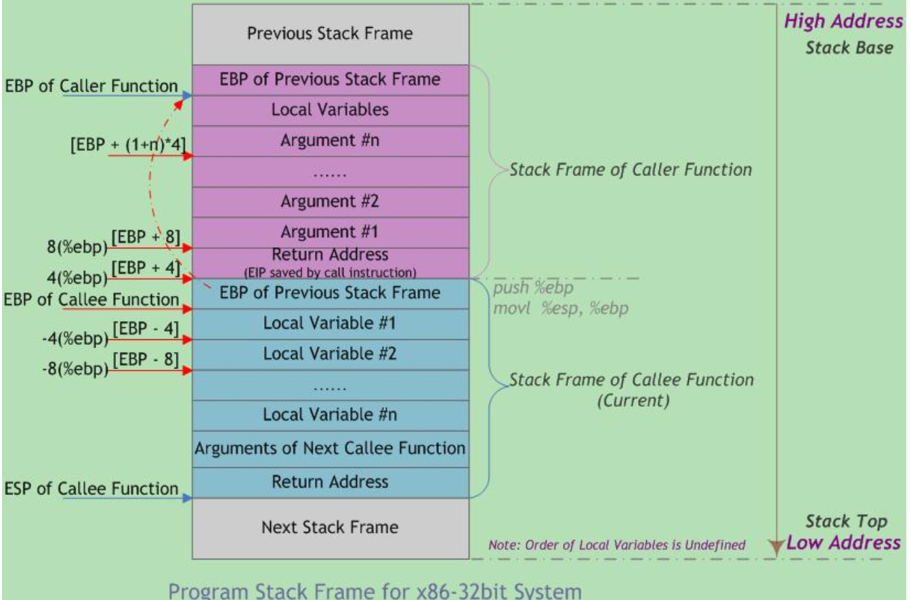

开始在循环跳出条件没有写ebp!=0

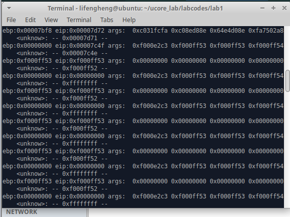

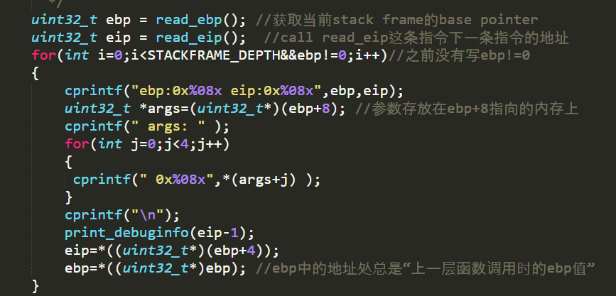

跟着提示写还是不困难

### 练习6

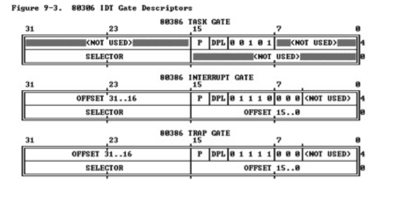

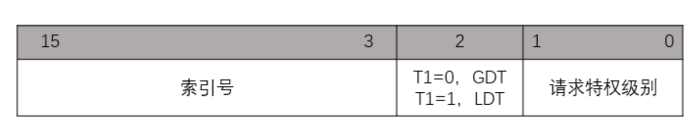

8个字节

第16-31位定义了处理代码入口地址的段选择子，使用其在GDT中查找到相应段的base address，加上offset就是中断处理代码的入口；

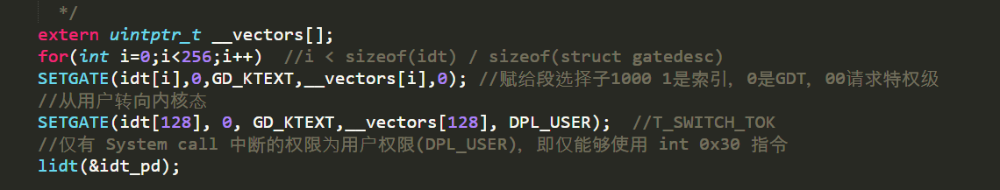

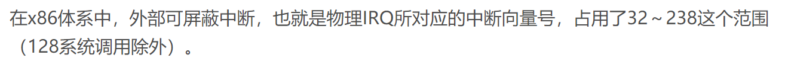

这里我搜到的Linu的系统调用应该是128，这给的是121。

参考资料

x86AT&T manual

gcc manual

make manual

https://blog.csdn.net/tiu2014/article/details/53998595

https://www.jianshu.com/p/2f95d38afa1d

菜鸟教程Linux shell指令

https://www.runoob.com/linux/linux-shell-io-redirections.html

怎么理解(*(void(*)())0)();

https://blog.csdn.net/yishizuofei/article/details/78351119

